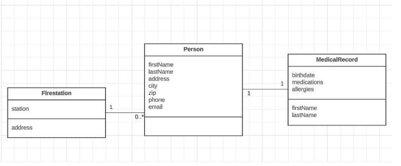
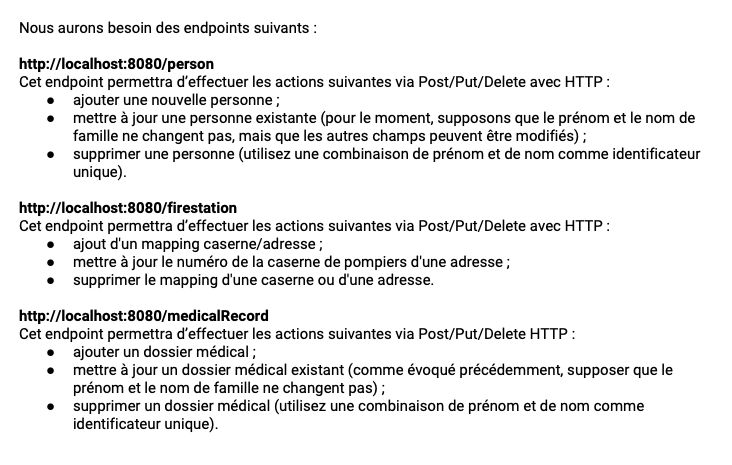
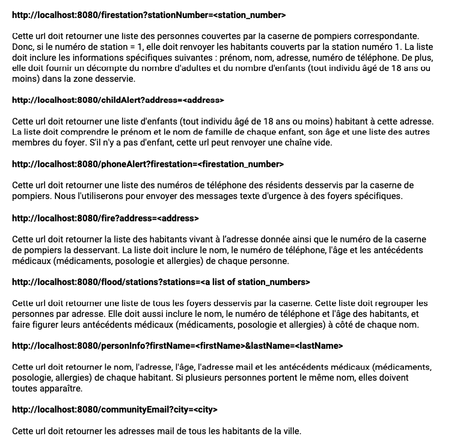
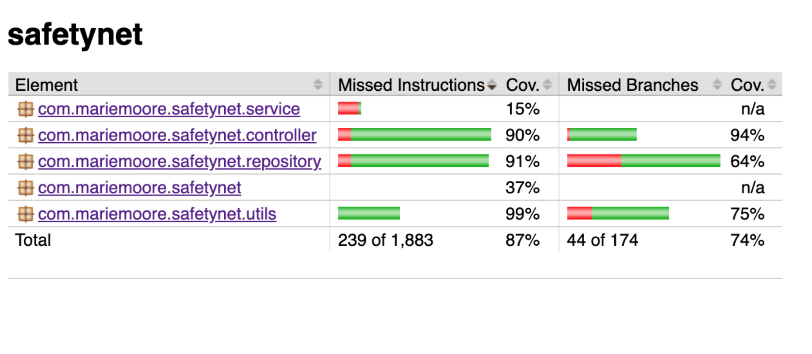
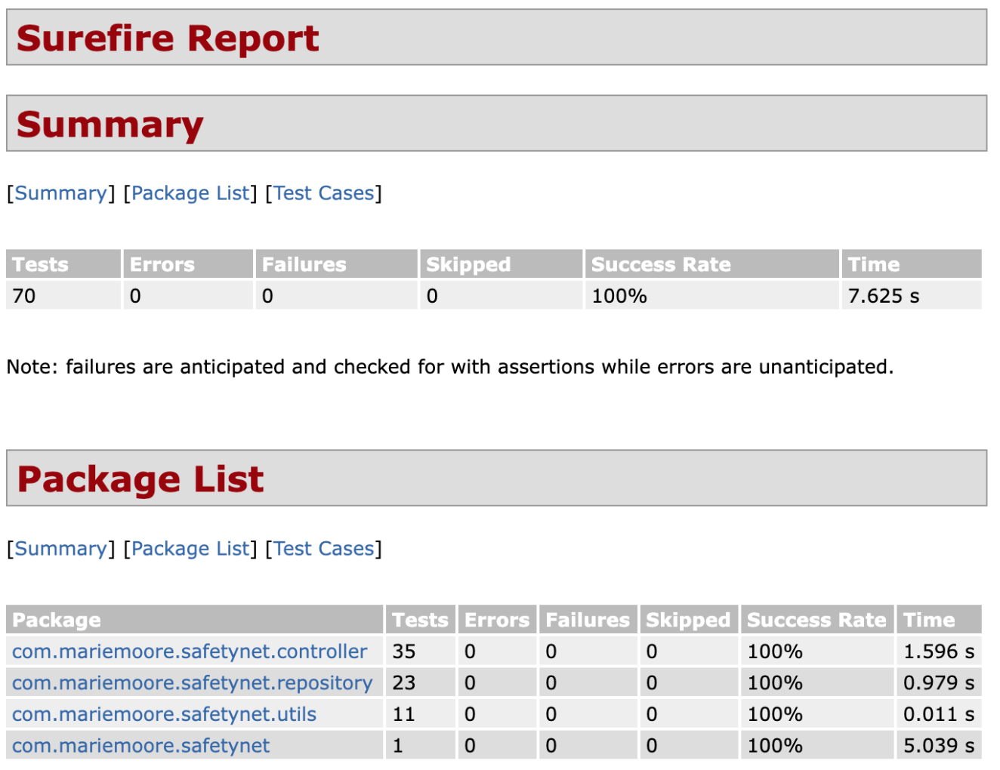

# Safetynet

## Installation et software requis
1. Cloner ce repo
2. Java 17 
3. IntelliJ ou un autre IDE installé
4. Postman
5. Démarrer SafetynetApplication
6. Appeler les différents URLs et Endpoints sur Postman

## UML

## URL

## Endpoints

## Rapport Jacoco

## Rapport Surefire

